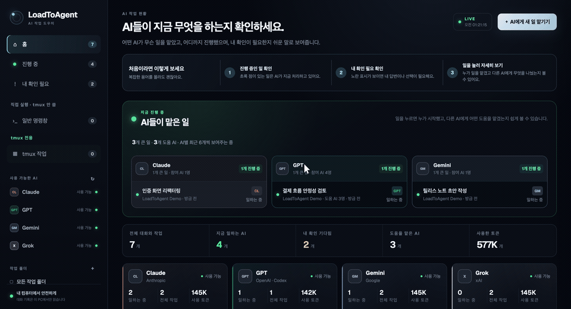

<div align="center">

# LoadToAgent

### One local command center for every AI agent at work.

Monitor Claude, Codex, Gemini, and Grok sessions, follow parent–subagent relationships, inspect token usage, and send work back to a connected terminal—without uploading your transcripts.

[](https://github.com/minjund/LodeToAgent/actions/workflows/desktop-ci.yml)


**English** | [简体中文](README.zh-CN.md) | [한국어](README.ko.md)

</div>

<div align="center">
  
</div>

> Your agent transcripts stay on your computer. LoadToAgent reads the local session files created by the AI tools you already use.

## Install

No Git checkout is required. Install the desktop app and its `loadtoagent` command through npm:

```bash
npm install -g loadtoagent
loadtoagent
```

The first command installs LoadToAgent for the current Node.js environment. The second opens the desktop dashboard. Use the same command to bring an existing LoadToAgent window to the front.

```bash
# Update
npm install -g loadtoagent@latest

# Remove
npm uninstall -g loadtoagent
```

Prebuilt macOS and Windows files are also attached to tagged [GitHub Releases](https://github.com/minjund/LodeToAgent/releases).

### Requirements

- macOS or Windows
- Node.js 18 or newer for npm installation
- At least one installed and authenticated CLI: Claude Code, Codex CLI, Gemini CLI, or Grok CLI
- tmux only if you want the optional tmux workspace map

## What LoadToAgent shows

| View | What you get |
|---|---|
| Agent map | Live work grouped by Claude, Codex, Gemini, and Grok |
| Relationship view | The request origin, selected agent, and every directly delegated subagent |
| Session detail | Conversation, tool activity, lifecycle events, model, workspace, and status |
| Token view | Input, output, cached, reasoning, total, and reported context-window usage |
| Terminal control | Local shell sessions plus safe command delivery to LoadToAgent-owned terminals |
| tmux workspace | Session → window → pane → AI process topology on macOS or Windows through WSL |

LoadToAgent distinguishes between a terminal it can control, a session that needs a bridge connection, a read-only session that must continue in its original app, and an ended session. It never types into an arbitrary external window.

## Use a connected terminal

Keep the LoadToAgent app open, then start an AI CLI through its authenticated local bridge:

```bash
loadtoagent run claude
loadtoagent run codex
loadtoagent run gemini
loadtoagent run grok
```

Arguments after `--` are passed to the provider CLI:

```bash
loadtoagent run claude -- --model claude-sonnet-4-6
```

The external terminal and LoadToAgent dashboard now control the same LoadToAgent-owned PTY. Existing sessions started elsewhere remain visible but read-only unless the original app exposes a supported handoff.

## Local-first by design

- Session files are read directly from your user profile.
- API key files are not read or displayed; authentication stays with each provider CLI.
- The terminal bridge uses a per-user token and a local named pipe or Unix domain socket.
- Renderer requests are isolated and validated before terminal or tmux actions run.
- Enabling workspace writes gives the selected AI permission to modify that folder, so use it only with repositories you trust.

Review the visible transcript before sharing your screen: agent conversations and tool inputs can contain sensitive project information.

## Develop locally

```bash
npm install
npm start
npm test
```

Additional checks and distributable builds:

```bash
npm run test:terminal
npm run test:bridge
npm run test:tmux -- macOS
npm run test:visual
npm run dist:mac
npm run dist:win
```

`dist:mac` produces Apple Silicon and Intel DMG/ZIP files. `dist:win` produces a portable Windows executable. Production macOS releases still require the maintainer's Apple signing and notarization credentials.

## Supported session sources

| Provider | Existing sessions | New work stream | Subagents |
|---|---|---|---|
| Claude | Claude Code local JSONL transcripts | Structured headless output | Transcript subagent records |
| Codex | Codex local rollout JSONL files | `codex exec --json` | `thread_spawn` parent metadata |
| Gemini | Gemini local chat JSON/JSONL files | Structured streaming output | Parent IDs when reported |
| Grok | Grok local session JSON/JSONL files | Structured streaming output | Parent IDs when reported |

Provider event mappings and context-window rules are documented in [Provider Contracts](docs/PROVIDER-CONTRACTS.md).

## Release

Tagged GitHub releases run the full test suite, publish the npm package with provenance, build macOS and Windows artifacts, and attach them to the release. The package version and release tag must match.

---

<div align="center">
  Built for people who run more than one AI agent—and still want to know exactly what each one is doing.
</div>
